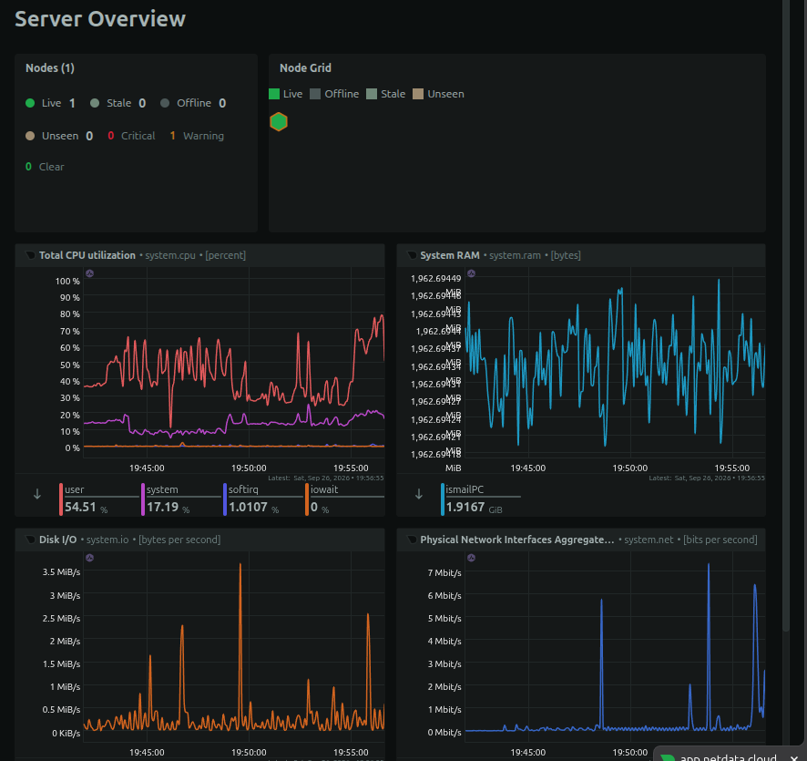

# netdata-monitoring-dashboard

A basic system monitoring project using [Netdata](https://www.netdata.cloud/).

The project monitors system resources through a Netdata dashboard, configures a CPU usage alert, and provides shell scripts for installation, testing, and cleanup.



## Features

* CPU monitoring
* RAM monitoring
* Disk monitoring
* Network monitoring
* Custom Netdata dashboard
* CPU usage alert

  * Warning: above 70%
  * Critical: above 80%
* Automated installation
* Automated CPU load test
* Cleanup script

## Project Structure

```text
simple-monitoring/
├── README.md
├── setup.sh
├── test_dashboard.sh
└── cleanup.sh
```

## Manual Setup

Netdata was installed using the Netdata kickstart script.

The dashboard can be accessed locally at:

```text
http://localhost:19999
```

The custom dashboard contains charts for:

* CPU
* RAM
* Disk
* Network

A custom CPU health alarm was also configured:

```text
WARNING  > 70%
CRITICAL > 80%
```

The alert was tested by generating CPU load with:

```bash
yes > /dev/null
```

The WARNING alert was successfully triggered.

## Scripts

### setup.sh

Installs Netdata using the official Netdata kickstart script.

```bash
./setup.sh
```

### test_dashboard.sh

Generates CPU load for 30 seconds so that the monitoring dashboard can be observed during a performance test.

```bash
./test_dashboard.sh
```

### cleanup.sh

Removes the Netdata installation using the Netdata uninstaller.

```bash
./cleanup.sh
```

## Technologies

* Linux
* Netdata
* Bash
* Git / GitHub

## What I Learned

* Installing and configuring Netdata
* Monitoring system resources
* Creating a custom monitoring dashboard
* Configuring health alerts
* Testing alerts with artificial system load
* Automating Linux administration tasks with Bash scripts
* Structuring a small monitoring project for GitHub

Project Idea: https://roadmap.sh/projects/simple-monitoring-dashboard